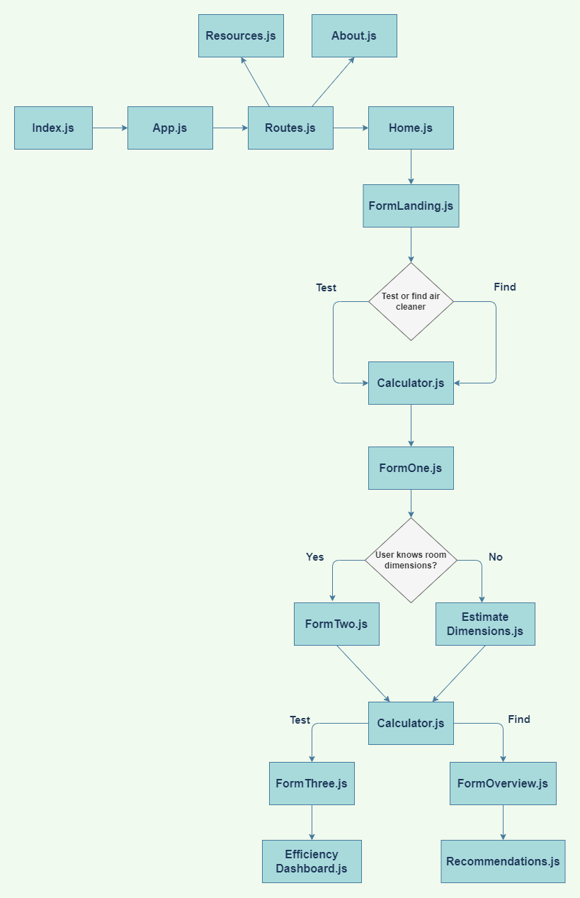

**University of Washington Informatics Capstone Project** | 
_Team iDreamers & Caduceus_ | Find us on [cleanairtool.com](https://cleanairtool.com/) !

## Authors

- **Jeanne Choi:** Project Manager | ychoi2@uw.edu | 

- **Gulsima Young:** Graphic Designer | gulyoung@uw.edu | 
- **Bijou Kim:** UX Designer | bijouk@uw.edu |  
- **Thomas Wilson:** UX Designer/Researcher | tommyw2@uw.edu |  
- **Christian Calloway:** Software Developer | cmarq07@uw.edu |  
- **Stanley Susanto:** Software Developer | susanto6@uw.edu |  
- **Misty Becker:** Web Developer | mistyb01@uw.edu |  
- **Natt Sakulbourrirug:** Database / Data Pipeline Manager | nattts@uw.edu |  
- **Sasha Anderson:** iSchool Project Advisor | sashaand@uw.edu |

## Project Overview
Clean Air Tool is a solution to aid in achieving safe indoor air quality. The original project focused on helping small businesses owners to maintain safe air quality in order to operational during the COVID-19 pandemic. Since then, we have redesigned and expanded the versatility of our product so that the Clean Air Tool can be used to find portable air cleaners and achieve cleaner air for any indoor space, from a bedroom to an office building.

## Advisory Board Members
- **Sasha Anderson** | iSchool Advisory Member 
- **Lisa Goodman** | Co-Founder and Board of Director @ Restart Partners
- **Dr. Edmund Seto** | Associate Professor @ University of Washington
- **Julie Reinhardt** | Small Business Owner
- **Marissa Baker** | Assistant Professor @ University of Washington
- **Sarah Lee** | Governor's Advanced Manufacturing Sector Lead @ Washington State Department of Commerce
- **Tresa Thomas-Massiongale** | Consultant @ Peacefield
- **Joey Fox** | HVAC Engineer

## Research
COVID-19 has left lasting economic, social, and ethical disruptions in our world, one of them being the economic impact on small businesses. Throughout the pandemic, owners and employees working in small businesses have been at great risk of exposure to COVID-19, as their jobs tend to put them in physical contact with many people (Gamio, 2020). This is a somewhat inevitable risk that they must take in order for a steady income and for their business to stay afloat. Major companies such as Walmart, Starbucks, and Uber are able to compensate with employee protections when their workers are sick, while small businesses may struggle with this since they may have less financial resources and employees.

Products such as a portable air cleaner can help mitigate the risks of COVID-19 that many small businesses face. Research has found that air cleaners can reduce the aerosol exposure by up to 65% and when using a combination of HEPA air cleaners and universal masking it can reduce the aerosol exposure by up to 90% (CDC, 2021). But, finding an air cleaner for a business means a lot more than a quick Google search. Many small business owners may not be aware of the proper usage of air filters for their space, let alone the importance of an air cleaner itself.

We've found that current market competitors do not offer a great user experience or provide education the importance and efficacy of air cleaners (Air Quality Engineering, 2014). Through the Clean Air Tool, we hope to expand on the previous groups work by improving the UI, keeping up with new scientific COVID findings, and include emphasis on educating users.

There are many health risks that occur without proper air quality in indoor spaces. With growing support of COVID-19 being an airborne virus(Molteni, 2021) along with the increase in other types of air pollutants, it's crucial to create a product that makes it simple for small businesses to ensure safety for workers and customers.

## Design
The current design of our product focuses on user-friendliness and simplicity. After many usability testings and trials, the forms for finding and testing an air cleaner were redesigned to be as short & simple as possible to prevent users from experiencing form fatigue. We incorporated many blues and whites into our design system to emphasize air & air flow, as well as to create a fresh, clean looking interface.

### Color Scheme

### Figma Prototype 
View the interactive prototype [here](https://www.figma.com/proto/5NQMu9hbsA7uH8fEN0S8fo/Clean-Air-Tool?node-id=1119%3A16441&scaling=scale-down&page-id=1119%3A16371&starting-point-node-id=1119%3A16441)

## Code Information
### Architecture
We built our project with JavaScript and React.js. All React components can be found in the src/components directory (except for the root App.js component which is in the src directory). We named the components clearly and organized them into folders where it made sense.

** Components ** (found in src/components)
- `Home.js`: the page that a user first sees when visiting the website.
- `Calculator.js`: this component tracks the state of all the form inputs, which is used in each form component, and in the recommendations and efficiency dashboard.
- `FormLanding.js`: the landing page of the form, which asks the user whether they want to Find or Test an air cleaner.
- `FormOne.js`: the first step (for both finding and testing an air cleaner), which asks whether the user knows their room dimensions. 
- `FormTwo.js`: If the user answers yes in FormOne.js, they can enter in their specific room dimensions on this page.
- `EstimateDimensions.js`: If the user answers no in FormOne.js, they can choose from multiple presets to estimate their room size on this page.
- `FormThree.js`: (For Test an Air Cleaner) the user can enter details about the air cleaner they want to test here.
- `EfficiencyDashboard.js`: (For Test an Air Cleaner) shows the results of the air cleaner efficiency test.
- `Recommendations.js`: (For Find an Air Cleaner) renders a list of suitable air cleaners given the user's room size.
- `PopupEfficiency.js` and `PopupRecommendations.js`: the brief popup that appears before the user views their results

to do: organize components into folders, and give the form components more descriptive names 

### Architectural Diagram

### What air cleaners are being recommended?

Air cleaners being recommended are read from the csv file src/air_cleaner_list.csv. There is a [Google Sheet](https://docs.google.com/spreadsheets/d/13sPIFx85lZRDi4NUUka7anrnjawND3cdsc1KKrWKu-w/edit?usp=sharing) where the air cleaners and information about them are stored and updated. The air cleaners being recommended all have HEPA filters. When the Google Sheet changes, save the sheet as a csv file and then replace src/air_cleaner_list.csv with it (the change needs to then be deployed to take affect). Current air cleaners were chosen from the [existing tool](https://docs.google.com/spreadsheets/d/1NEhk1IEdbEi_b3wa6gI_zNs8uBJjlSS-86d4b7bW098/edit#gid=1882881703), the ConsumerLab.com article [Which air purifiers are best for reducing the spread of COVID-19?](https://www.consumerlab.com/answers/portable-air-cleaner/air-purifier/), and the California Air Resource Board's List of [CARB-Certified Air Cleaning Devices](https://ww2.arb.ca.gov/list-carb-certified-air-cleaning-devices)

Note: It is important that the column names are not changed in the Google Sheet. It is also important that the format of the data is kept consistent ($ symbols should not be added to the Price column as the other values in the column contain only numbers, the Size column should always have values in the format of 'number "x" number "x" number', etc.). The CADR column is in units of feet3/minute.

### Air Cleaner Calculations Used

**Terms Defined for the Calculations Below:**

- ACH: Air Changes Per Hour
- CADR: Clean Air Delivery Rate (units of feet3/minute)
- Room volume is either in units of feet3 or meters3
- Ventilation is assumed to be 1 ACH for any room
- The 60 in the below calculation is in units of minute / hour.
- The 0.58 in the below calculation is in units of (hour * feet3)/(minute * meters3)

When recommending air cleaners to users, we take the user's entered room volume and assume that all spaces have a bad ventilation rating of 1 to estimate the ACH that each air cleaner would give their room. We only recommend air cleaners with that would give the user's space an estimated ACH of 4 or more.

**If Units are Meters:**
  Estimated ACH of user's space = (((Air Cleaner's CADR) * 60 / Room Volume) * Number Of Air Cleaners Being Used) + Ventilation rating of 1

**If Units are Feet:**
  Estimated ACH of user's space = (((Air Cleaner's CADR) / 0.58 / Room Volume) * Number Of Air Cleaners Being Used) + Ventilation rating of 1

### Running the application locally

You will need to have `npm` installed. You can install it [here](https://docs.npmjs.com/getting-started/). Once npm is installed, you can run `npm install` in the project directory to install required dependencies for the project. Finally, run `npm start` to run the app. You will be able to view it at http://localhost:3000 in your browser.

### Running tests
Run `npm test -- fileName.test.js` to run a test file. The different test files conflict when being run so they need to be run individually and the code in the test files not currently being run needs to be commented. We used [react-testing-library](https://testing-library.com/docs/react-testing-library/intro/) to create our tests. The tests ensure any calculations we use work as expected and also user interaction like filtering/sorting works as expected.

# Opportunities & Next Steps 

**Database & APIs (dynamic/static database)**

For the reccomendations page, we were planning on having cleaners being recommended from the following API provided by Energy Star's certified list of room air cleaners. Link to the overall page is [here](https://www.energystar.gov/productfinder/product/certified-room-air-cleaners/results) and the link to the API is [here](https://dev.socrata.com/foundry/data.energystar.gov/jmck-i55n).

However, we ran into constraints with the database that clashed with our design that we wanted to accomplish. We wanted to add pricing and imaging so users could pick the air cleaners they wanted directly on our website. This data is not available within the Energy Star database. 

To solve this, we needed to use another database. We were able to successfuly connect a UPC api titled [upcitemdb](upcitemdb.com), and paired with the Energy Star database we are able to receive promising results which were frequently updated. However due to the overwhelming cost of upgrading ($99 for beginner package) as well as the lack of air cleaners (~50) which had the data we wanted (pictures + pricing information), we went with a static database.

**Reccomendations Page Compare Feature**

We wanted to have a compare feature within our reccomendations page. This would entail listing the cards on the reccomendation page (as they are), but they would have a button which states 'compare'. The user can select 'compare', and this would bring them into a seperate page with more advanced/detailed information. 

This would be a **nice to have feature** if we were able to fully educate the user on the data they are seeing; but because we had a time constraint, we were unable to implement this feature.

**Education aspect: crash course, tool tips**

We also wanted to have a *quiz / crash course*, which would teach the user about how to maintain their air cleaner / what different air cleaner information means (e.g. filter type, CADR..). We made all of the interfaces but it unfortunately ran out of scope for our project.

Tool tips unfortunately ran out of scope; we wanted to ensure we were able to design all of the essential features before executing the education aspect. 

**Dataviz opportunities**

Data visualiation is a great way to show, rather than *tell* things. This could be used in conjunction with the education aspect of the tool, or within the forms aspect in some way to help deepen understanding, especially for users who do not have a strong grasp over english.      

**Research opportunities**
CO2 filteration 
